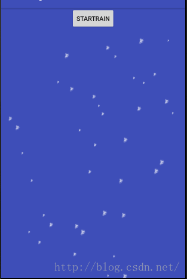
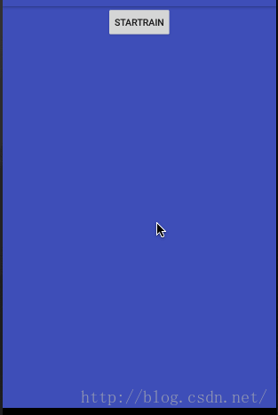

# SnowFlyView
The stye of  snow falling

#### There are two styles：

#### The first—falling all the time：
```xml
<com.lesences.snowflyview.SnowFlyView
        android:id="@+id/snow_fly"
        android:layout_width="match_parent"
        android:layout_height="match_parent"
        android:layout_marginTop="@dimen/activity_vertical_margin"
        app:snow_bitmap="@mipmap/snowflake"
        app:snow_count="40"
        app:snow_initToLeft="15dp"
        app:snow_initToRight="15dp"
        app:snow_maxScale="1.20"
        app:snow_minScale="0.45"
        app:snow_xSpeed="50.0"
        app:snow_ySpeed="300.0" />
```
#### Demo:


#### The second— stop falling in the duration: duration must more than 300 !
```xml
<com.lesences.snowflyview.SnowFlyView
        android:id="@+id/snow_fly"
        android:layout_width="match_parent"
        android:layout_height="match_parent"
        android:layout_marginTop="@dimen/activity_vertical_margin"
        app:snow_bitmap="@mipmap/snowflake"
        app:snow_count="40"
        app:snow_duration="5000"
        app:snow_initToLeft="15dp"
        app:snow_initToRight="15dp"
        app:snow_maxScale="1.20"
        app:snow_minScale="0.45"
        app:snow_xSpeed="50.0"
        app:snow_ySpeed="300.0" />
```
#### Demo:
